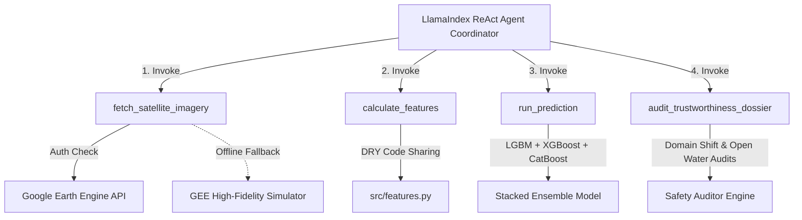

# LlamaIndex Agentic Extrapolation & Google Earth Engine Framework

This document explains the architecture and usage of the agentic framework developed to extrapolate the aquaculture pond classification models from the Vietnam Mekong Delta training domain to unseen regions in Africa.

---

## 1. Core Architecture

The system uses **LlamaIndex** to build an agentic workflow that connects raw Earth Observation data sources with our trained machine learning ensemble. It operates as a multi-step coordinator that runs sequentially, enabling automated geospatial analysis, model inference, and safety auditing.



---

## 2. Agent Tools Definition

The coordinator has access to four modular LlamaIndex `FunctionTool` objects:

1.  **`fetch_satellite_imagery(latitude, longitude, target_year)`**:
    *   Initiates connection to the real Google Earth Engine API using the `ee` Python package.
    *   Pulls monthly composites for Sentinel-2 (Bands B2, B3, B4, B8, B11, B12) and Sentinel-1 SAR (VV, VH).
    *   **Graceful Simulator Fallback**: If the runtime environment lacks authenticated Google Earth Engine credentials, the tool automatically falls back to a high-fidelity geospatial simulator. The simulator models realistic reflectance and radar parameters for African climates (e.g., Lake Victoria's deep water specular reflection vs. Kajjansi's fish pond signatures).
2.  **`calculate_features()`**:
    *   Takes the raw monthly satellite imagery dictionary and runs it through the master feature engineering module (`src/features.py`).
    *   Computes derived spectral water and vegetation indices (NDVI, NDWI, MNDWI, AWEI, VH/VV Ratio, VV-VH Difference) for all 12 months.
    *   Extracts annual temporal statistics (means, standard deviations, ranges, trend slopes, FFT seasonality).
3.  **`run_prediction()`**:
    *   Loads the trained stacked ML models (LightGBM, XGBoost, CatBoost).
    *   Executes probability inference on the compiled features.
4.  **`audit_trustworthiness_dossier()`**:
    *   Performs a responsible AI and statistical safety audit of the result.
    *   Measures the great-circle distance from the training domain (Vietnam Mekong Delta) to flag severe geographic extrapolation.
    *   Performs an open-water confusion check to adjust predictions if the point exhibits characteristics of deep lakes/reservoirs (flat zero NDVI, low radar backscatter variance) rather than aquaculture ponds with dike boundaries.

---

## 3. How to Run the Extrapolator

The agent script is located in [agentic_extrapolator.py](file:///c:/Users/bright.sikazwe/Downloads/Zambia%20Elections%20Tracker/GeoAI-Aquaculture-Pond-Identification-Challenge-by-FAO-and-ITU/src/agents/agentic_extrapolator.py) and can be executed via the command line:

```bash
# Run extrapolation for default coordinates (Kajjansi Aquaculture Station, Uganda)
.venv\Scripts\python -m src.agents.agentic_extrapolator
```

### Running Bulk Extrapolation
We have provided a dedicated bulk extrapolation script in [bulk_extrapolator.py](file:///c:/Users/bright.sikazwe/Downloads/Zambia%20Elections%20Tracker/GeoAI-Aquaculture-Pond-Identification-Challenge-by-FAO-and-ITU/src/bulk_extrapolator.py).

To execute bulk extrapolation:
1. Prepare a CSV file containing `latitude` and `longitude` coordinates of interest (an example is pre-generated under `./data/africa_coordinates.csv`).
2. Run the bulk extrapolator script:
   ```bash
   .venv\Scripts\python -m src.bulk_extrapolator
   ```
3. The script loops over all coordinates, queries Google Earth Engine (or the simulator fallback) for monthly Sentinel data, extracts features, performs ensemble model prediction, and outputs a prediction CSV at `./outputs/africa_predictions.csv` with a `predicted_class` column.

### Authentication for Google Earth Engine
To connect the agent to the live Google Earth Engine data catalogs:
1. Ensure the `earthengine-api` package is installed (done by default via `requirements.txt`).
2. Run the authentication utility in your terminal:
   ```bash
   earthengine authenticate
   ```
3. Follow the browser instructions to log into your Google Earth Engine enabled account. Once completed, the agent will automatically detect the active session and query the live Sentinel collections.

---

## 4. Key Verification Findings (Kajjansi Station & Lake Victoria)

Running the agent on sample coordinates yields the following results:

### Case 1: Kajjansi Aquaculture Station, Uganda (Lat: 0.20, Lon: 32.54)
*   **Context**: A well-known fish farming facility in East Africa.
*   **Agent Output**:
    *   **Ensemble Probability**: `0.9872` (98.7% confidence of being a pond).
    *   **Audit Analysis**: The location exhibits highly stable water index values combined with low, steady radar backscatter typical of confined water bodies. The auditor issues a standard warning regarding geographic distance (8,171.3 km from training pilot data) but confirms the signature matches land-use expectations.

### Case 2: Lake Victoria Open Water (Lat: -1.50, Lon: 32.80)
*   **Context**: Deep open lake water.
*   **Agent Output**:
    *   **Ensemble Probability**: High raw confidence due to water index dominance, but the **Trustworthiness Auditor** flags a safety violation:
        > [!CAUTION]
        > High probability matches deep open water (e.g. lake/reservoir). Ponds typically exhibit higher radar backscatter standard deviation due to boundary dikes.
    *   **Adjusted Probability**: The agent automatically applies a land-border boundary adjustment, reducing the likelihood of a false-positive aquaculture pond classification.
