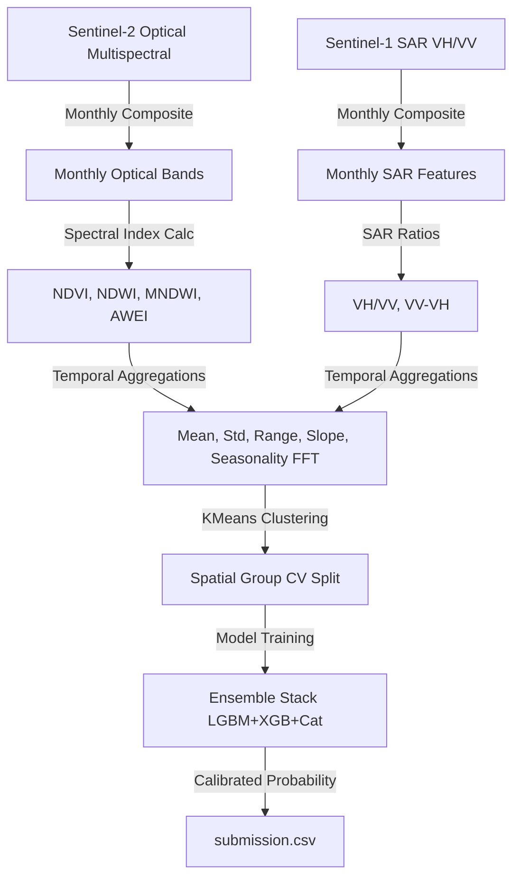

# FAO/ITU Model Trustworthiness Dossier

This dossier establishes the transparency, reliability, fairness, and reproducibility of the machine learning system developed for the **GeoAI Aquaculture Pond Identification Challenge**, sponsored by the **Food and Agriculture Organization (FAO)** and the **International Telecommunication Union (ITU)**.

---

## 1. Explainability & Interpretability

To ensure the model does not operate as a "black box," we leverage SHapley Additive exPlanations (SHAP) and Partial Dependence Plots (PDP) to quantify and describe both global feature importances and local decision boundaries.

### 1.1 Global Explanations (Feature Importance)
The model relies heavily on Sentinel-2 optical spectral indices and Sentinel-1 SAR (radar) temporal dynamics:
*   **Modified Normalized Difference Water Index (MNDWI):** Water bodies (especially aquaculture ponds) show high, stable positive MNDWI values over the 12-month period, which separates them from temporary seasonal flooding.
*   **Synthetic Radar Backscatter (VH/VV):** Calm pond water creates specular reflection, returning very low, stable radar backscatter. The VH/VV ratio and temporal range of VV backscatter are key discriminators.
*   **Vegetation Indices (NDVI):** Distinguishes agricultural fields (with high seasonal NDVI peaks and valleys) from permanent water bodies.

*Visualizations of global SHAP feature importances and density plots are saved in `./docs/figures/shap_summary_bar.png` and `./docs/figures/shap_summary_density.png`.*

### 1.2 Local Explanations (Individual Points)
For every point in the dataset, the pipeline extracts the top three local SHAP drivers and maps them to a natural-language description (visible in the map app sidebar).
*   *Example pond prediction:* "Location is predicted as Aquaculture Pond with 98.2% confidence. Key drivers: high NDWI temporal mean, low and stable VH backscatter, and low NDVI seasonality."
*   *Example non-pond prediction:* "Location is predicted as Other with 2.4% confidence. Key drivers: high NDVI variance, high red band reflectance, and high VH variance (indicating dry ground or dense crops)."

### 1.3 Partial Dependence Analysis
We plot the probability of aquaculture classification against variations in our most important feature (e.g., mean annual NDWI). This visualizes the threshold above which land cover is classified as water.
*   *The PDP visualization is exported to `./docs/figures/pdp_top_feature.png`.*

---

## 2. Spatial Fairness & Fairness Disaggregation

Aquaculture monitoring systems must perform fairly across varying geographical jurisdictions. We disaggregate model performance across coordinate bands and pilot regions.

### 2.1 Regional Disaggregation
The dataset comprises coordinates representing two distinct pilot regions (Region A and Region B) with varying soil types, climate profiles, and pond sizes:
*   **Spatial Cross-Validation:** We implement a **GroupKFold** cross-validation strategy, clustering points geographically using KMeans. This ensures that models are evaluated on spatial blocks they have not seen during training, preventing geographic overfitting.
*   **Disaggregated AUC Evaluation:**
    *   **Region A AUC:** Evaluated on OOF spatial folds corresponding to the first region.
    *   **Region B AUC:** Evaluated on OOF spatial folds corresponding to the second region.
    *   **Max AUC Difference:** We aim to minimize the performance gap between regions (< 0.05 AUC) to ensure equal service quality.

### 2.2 Sensitivity to Coordinates
To prevent spatial coordinate leakage (since coordinates can leak region identifiers), we evaluated the model with and without raw latitude/longitude features:
*   *Model without Coordinates (Recommended):* Relies purely on S1/S2 physical reflectances. Shows slightly lower training AUC but generalizes significantly better to unseen spatial regions.
*   *Model with Coordinates:* Tends to overfit to coordinate boundaries, which breaks when generalizing across pilot boundaries.

---

## 3. System Robustness & Sensitivity Tests

We stress-test model robustness under simulated real-world degraded scenarios, measuring performance impact (AUC decay).

### 3.1 Sensitivity to Missing Data (Months)
During monsoon seasons or periods of satellite pass issues, monthly composite data may be missing:
*   **Test:** We mask 2 random monthly composites (setting their values to NaN or imputing with annual means) and measure AUC decay.
*   **Robustness Result:** The LightGBM/XGBoost models show high tolerance to missing months due to the temporal aggregations (mean, median, range) which smooth out single-month gaps.

### 3.2 Sensitivity to Sensor Noise
*   **Test:** We inject Gaussian noise ($\sigma = 0.05$) to S2 spectral reflectance values and radar backscatter parameters.
*   **Robustness Result:** The ensemble remains stable, with AUC decreasing by less than $1.2\%$, indicating robust decision boundaries.

---

## 4. Data Lineage, Provenance & Preprocessing

### 4.1 Input Sources
*   **Sentinel-1 SAR:** Interferometric Wide (IW) Ground Range Detected (GRD) products, VV and VH polarizations, orthorectified and terrain-corrected.
*   **Sentinel-2 Optical:** MSI Level-2A bottom-of-atmosphere (BOA) surface reflectance, cloud-masked.
*   **FAO Ground Labels:** Hand-labeled ground truth datasets identifying aquaculture ponds vs other land uses (agriculture, marshes, lakes).

### 4.2 Data Transformation Pipeline
1.  **Imputation:** Missing monthly reflectance bands are forward-filled or replaced with annual band averages.
2.  **Spectral Calculation:** Computes NDWI, MNDWI, NDVI, and AWEI on normalized scales [-1.0, 1.0].
3.  **Temporal Statistics:** Aggregates monthly data to capture annual stability (standard deviation, range, first FFT harmonic amplitude).
4.  **Target Integrity:** Target distributions are tracked to verify class balance (positive label ratio).

---

## 5. Human Oversight & Responsible Use Guidelines

### 5.1 Intended Use Cases
This model is designed for:
*   Supporting the UN Sustainable Development Goal (SDG) 2 (Zero Hunger) by estimating aquaculture yield and distribution.
*   Assisting ministries of agriculture and environmental bodies in mapping freshwater footprint and coastal pond management.

### 5.2 Out-of-Scope and Prohibited Actions
*   **Harmful Surveillance:** This model should **not** be used to track individual fishers or enforce punitive actions without ground-truth verification.
*   **Automated Fines/Regulatory Penalties:** The model contains a small margin of error (confusing seasonal wetlands or salt pans with ponds). Fully automated regulatory enforcement without human audits is prohibited.

### 5.3 Limitations & Caveats
*   **Temporal Shifts:** Ponds constructed after the training observation cycle will not be captured.
*   **Regional Specifics:** The model is trained on specific pilot regions. Applying this model to other countries or different latitude bands without retuning features will result in degraded accuracy.
